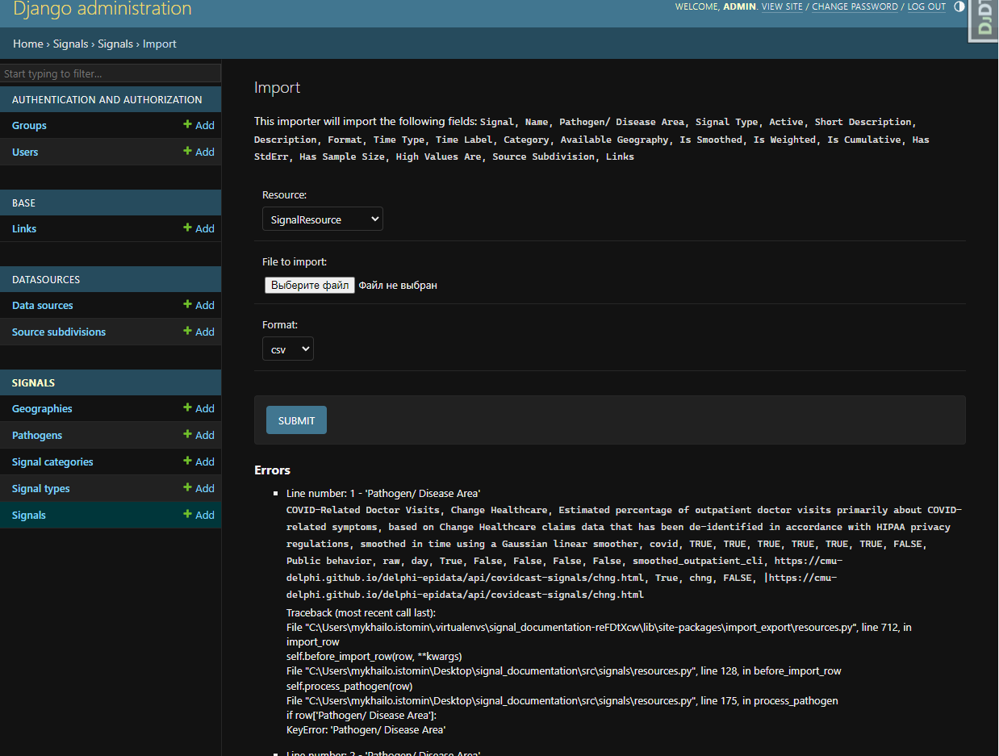

# Signal Documentation
Single Source of Documentation System

## Core libs and DB
1. [Django](https://www.djangoproject.com/)
2. [Django-filter](https://django-filter.readthedocs.io/en/stable/index.html)
3. [PostgreSQL](https://www.postgresql.org/)


All requirements you can find in `Pipfile`

## Getting started

### Setup Env Vars

create `.env` file and add variables like in `.env.example`

### To run locally

Install `python:3.10`, `pip3`, `pipenv`

Using [pipenv](https://github.com/pypa/pipenv) run `pipenv shell` and `pipenv install` to create virtual environment and install dependencies

```sh
$ pipenv shell
$ pipenv install
```

Go to `src` directory and run

```sh
$ python manage.py migrate
$ python manage.py test
$ python manage.py runserver
```

load fixtures
```sh
$ python manage.py loaddata .\fixtures\available_geography.json
$ python manage.py loaddata .\fixtures\pathogens.json
$ python manage.py loaddata .\fixtures\signal_categories.json
$ python manage.py loaddata .\fixtures\signal_types.json
```

if you need test coverage

```sh
$ coverage erase
$ coverage python manage.py test
$ coverage report
```

you can also get test coverage with one command
```sh
$ coverage erase && coverage run manage.py test && coverage report
```

sort imports
```sh
$  isort .
```
check flake
```sh
$  flake8 --show-source
```

### To run via docker

Install `Docker` and `docker-compose`

Run
```sh
$ docker-compose build
$ docker-compose up

```

Open `http://localhost:8000` to view it in the browser

### To run via docker and emulate production

Though probably not necessary in most cases, if you want to test/modify/emulate how this will run in production you can:

- In `.env` set:

```shell
DEBUG = 'False'
```

- Modify the app container's command in `docker-compose.yaml` to run:

```shell
gunicorn signal_documentation.wsgi:application --bind 0.0.0.0:8000"

*(Essentially you'll replace just the last line of the command, switching out the "runserver" line)
```

Open `http://localhost` to view it in the browser. In this usage your request will be serviced by Nginx instead of the application directly.

The primary use case for this will be when making changes to the Nginx container image that runs in production and hosts the static file content, or also if making changes to the Gunicorn config.

Additionally, though again not required for local development, you can also specify an env var of `MAIN_PAGE = $name`, and the app will be served at `http://localhost:8000/$string` (if running in debug mode), or if you've set `DEBUG = 'False'` to run it in Nginx/production mode at `http://localhost/$string/`. Note the ending slash when in Nginx/production mode _and_ using the `MAIN_PAGE` env var.

The primary use case is so that we have flexibility to serve the application at something other than the "bare" URL, though doing this is not necessary for local development.

Changes of this sort should be carefully evaluated as they may require interaction with systems managed by devops folks.

## [Django admin](https://docs.djangoproject.com/en/4.1/ref/contrib/admin/) web interface (user should be `is_staff` or `is_superuser`)
`http://localhost:8000/admin`

## Documentation

The project documentation is generated and served using the following tools:

1. [Sphynx](https://www.sphinx-doc.org/en/master/).
2. [sphinxcontrib-django](https://sphinxcontrib-django.readthedocs.io/en/latest/>).
3. [sphinx_rtd_theme](https://sphinx-rtd-theme.readthedocs.io/en/stable/).
4. [django-docs](https://django-docs.readthedocs.io/en/latest/>).
5. [drf-spectacular](https://drf-spectacular.readthedocs.io/en/latest/>).

### Read the docs (Sphynx)
Auto generated documentation for the project web appplication is available at the following URL.

``http://localhost:8000/<MAIN_PAGE>/docs/index.html``

To clean the documentation, run the following commands:

```sh
   $ cd ./docs
   $ make clean
```

To generate the documentation, run the following commands:

```sh
   $ cd ./docs
   $ make html
```

### Swagger
Auto generated swagger documentation for the project web appplication is available at the following URL.

``http://localhost:8000/<MAIN_PAGE>/api/docs/swagger/``

### Redoc
Auto generated redoc documentation for the project web appplication is available at the following URL.

``http://localhost:8000/<MAIN_PAGE>/api/docs/redoc/``


## Import data from admin interface

For data import used [django-import-export](https://django-import-export.readthedocs.io/en/latest/index.html) library

The code consists of Django resource classes that are used for importing and exporting CSV files using the Django Import-Export library:
1. `SignalResource` - this resource class is used for importing `Signal` models:
    * Defines various fields such as `name`, `display_name`, `pathogen`, `signal_type`, and `source`.
    * Defines the `before_import_row` method, which is called before importing each row and allows for pre-processing of the data.
    * Includes methods like `is_url_in_domain` to check if a URL belongs to a specific domain, `fix_boolean_fields` to handle boolean fields, and `process_links` to process the links field.

2. `SignalBaseResource` - This resource class is used for updating already created `Signal` models `base` fields with base Signals.
    * Defines various fields such as `name`, `display_name`, `base`, and `source`.
    * Defines the `before_import_row` method, which is called before importing each row and allows for pre-processing of the data.
    * The `process_base` method is responsible for processing the `base` field by retrieving the corresponding `Signal` object based on the provided `name` and `source`.

3. `SourceSubdivisionResource` - this resource class is used for importing `SourceSubdivision` models
    * It defines fields such as `name`, `display_name`, `description`, `data_source`, and `links`.
    * It includes the `before_import_row` method for pre-processing each row before importing.
    * The `process_links` method is responsible for processing the `links` field by creating `Link` objects based on the provided URLs.
    * The `process_datasource` method processes the `data_source` field by creating or retrieving a `DataSource` object based on the provided name.

These resource classes provide a structured way to import CSV files. They define the fields, handle pre-processing of data, and interact with the corresponding models and related objects.

### Import data flow

To import data from a CSV file must meet the requirements:
* CSV file should be properly formatted and contains all the required fields for importing, as specified by the resource classes (`SignalResource`, `SignalBaseResource`, `SourceSubdivisionResource`). The header row of the CSV file should match the field names defined in the resource classes.
* It should not contain empty rows from the CSV file before importing. Empty rows may cause validation errors during the import process.
* Colums should be saparateb by `","`

Othervice you will receive Errors during import process:



1. Import `SourceSubdivision` instances with `SourceSubdivisionResource` - [http://localhost:8000/admin/datasources/sourcesubdivision/import/](http://localhost:8000/admin/datasources/sourcesubdivision/import/)


2. Import `Signal` instances with `SignalResource` - [http://localhost:8000/admin/signals/signal/import/](http://localhost:8000/admin/signals/signal/import/)


3. Import `Signal.base` fields with `SignalBaseResource` - [http://localhost:8000/admin/signals/signal/import/](http://localhost:8000/admin/signals/signal/import/)


## Deployment

This application gets deployed (at a minimum) to two environmetns:

Production - <https://delphi.cmu.edu/{app_name}>

Staging - <https://staging.delphi.cmu.edu/{app_name}>

Each environment is essentially a bunch of different services all governed by `docker-compose`, running across multiple hosts, with various layering of proxies and load balancers.

### Basic workflow

- A PR merged to either `development`, `staging`, or `main` will trigger CI to build container images that are then tagged with the branch name (or ":latest", in the cast of `main`), and stored in our GitHub Packages container image repository.
- CI triggers a webhook that tells the host systems to pull and run new container images and restart any services that have been updated.

As a developer, your path to getting changes into production should be something like this:

- Source your working branch from `development`, do work, PR and merge when complete
- PR and merge to `staging` in order to get your changes deployed to https://staging.delphi.cmu.edu/signals for review
- PR and merge to `main` to go to production

**IMPORTANT!** - The CI/CD process uses Docker Compose to build the specific container images that will be used in external environments. Success of the the build-and-deploy workflow is dependent on constructed services in `docker-compose.yaml`. If considering making changes there, please have a PR reviewed by devops folks :pray: :pray: :pray:

### Control of the deployed environment

The environment and secrets used for deployment live in <https://github.com/cmu-delphi/delphi-ansible-web>. Any changes to the environment should be made there and then tested and validated by devops folks.
