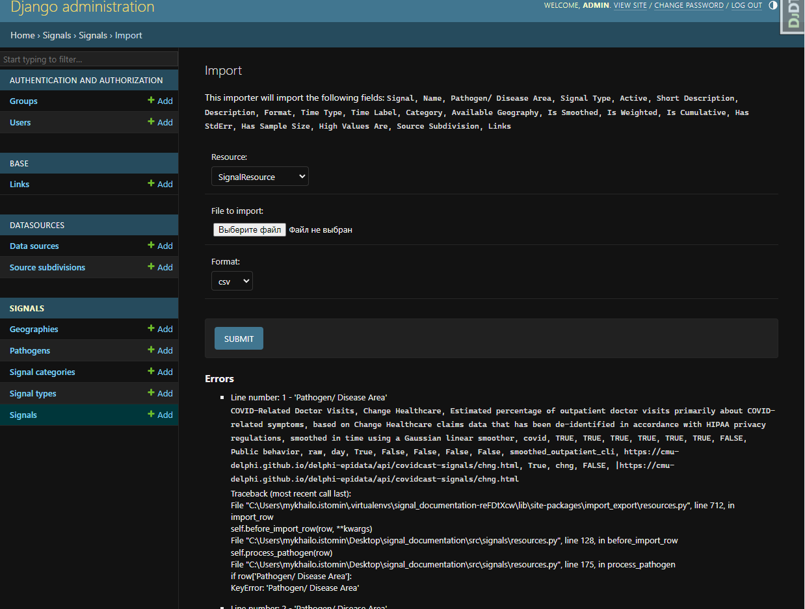

# Signal Documentation
Single Source of Documentation System

## Core libs and DB
1. [Django](https://www.djangoproject.com/)
2. [Django-filter](https://django-filter.readthedocs.io/en/stable/index.html)
3. [PostgreSQL](https://www.postgresql.org/)


All requirements you can find in `Pipfile`

## Getting started

### Setup Env Vars

create `.env` file and add variables like in `.env.example`

### To run locally

Install `python:3.10`, `pip3`, `pipenv`

Using [pipenv](https://github.com/pypa/pipenv) run `pipenv shell` and `pipenv install` to create virtual environment and install dependencies

```sh
$ pipenv shell
$ pipenv install
```

Go to `src` directory and run

```sh
$ python manage.py migrate
$ python manage.py test
$ python manage.py runserver
```

load fixtures
```sh
$ python manage.py loaddata .\fixtures\available_geography.json
$ python manage.py loaddata .\fixtures\pathogens.json
$ python manage.py loaddata .\fixtures\signal_categories.json
$ python manage.py loaddata .\fixtures\signal_types.json
```

if you need test coverage

```sh
$ coverage erase
$ coverage python manage.py test
$ coverage report
```

you can also get test coverage with one command
```sh
$ coverage erase && coverage run manage.py test && coverage report
```

sort imports
```sh
$  isort .
```
check flake
```sh
$  flake8 --show-source
```

### To run via docker

Install `Docker` and `docker-compose`

Run
```sh
$ docker-compose build
$ docker-compose up

```

Open `http://localhost:8000` to view it in the browser

## [Django admin](https://docs.djangoproject.com/en/4.1/ref/contrib/admin/) web interface (user should be `is_staff` or `is_superuser`)
`http://localhost:8000/admin`


## Import data from admin interface

For data import used [django-import-export](https://django-import-export.readthedocs.io/en/latest/index.html) library

The code consists of Django resource classes that are used for importing and exporting CSV files using the Django Import-Export library:
1. `SignalResource` - this resource class is used for importing `Signal` models:
    * Defines various fields such as `name`, `display_name`, `pathogen`, `signal_type`, and `source`.
    * Defines the `before_import_row` method, which is called before importing each row and allows for pre-processing of the data.
    * Includes methods like `is_url_in_domain` to check if a URL belongs to a specific domain, `fix_boolean_fields` to handle boolean fields, and `process_links` to process the links field.

2. `SignalBaseResource` - This resource class is used for updating already created `Signal` models `base` fields with base Signals.
    * Defines various fields such as `name`, `display_name`, `base`, and `source`.
    * Defines the `before_import_row` method, which is called before importing each row and allows for pre-processing of the data.
    * The `process_base` method is responsible for processing the `base` field by retrieving the corresponding `Signal` object based on the provided `name` and `source`.

3. `SourceSubdivisionResource` - this resource class is used for importing `SourceSubdivision` models
    * It defines fields such as `name`, `display_name`, `description`, `data_source`, and `links`.
    * It includes the `before_import_row` method for pre-processing each row before importing.
    * The `process_links` method is responsible for processing the `links` field by creating `Link` objects based on the provided URLs.
    * The `process_datasource` method processes the `data_source` field by creating or retrieving a `DataSource` object based on the provided name.

These resource classes provide a structured way to import CSV files. They define the fields, handle pre-processing of data, and interact with the corresponding models and related objects.

### Import data flow

To import data from a CSV file must meet the requirements:
* CSV file should be properly formatted and contains all the required fields for importing, as specified by the resource classes (`SignalResource`, `SignalBaseResource`, `SourceSubdivisionResource`). The header row of the CSV file should match the field names defined in the resource classes.
* It should not contain empty rows from the CSV file before importing. Empty rows may cause validation errors during the import process.
* Colums should be saparateb by `","`

Othervice you will receive Errors during import process:



1. Import `SourceSubdivision` instances with `SourceSubdivisionResource` - [http://localhost:8000/admin/datasources/sourcesubdivision/import/](http://localhost:8000/admin/datasources/sourcesubdivision/import/)


2. Import `Signal` instances with `SignalResource` - [http://localhost:8000/admin/signals/signal/import/](http://localhost:8000/admin/signals/signal/import/)


3. Import `Signal.base` fields with `SignalBaseResource` - [http://localhost:8000/admin/signals/signal/import/](http://localhost:8000/admin/signals/signal/import/)


