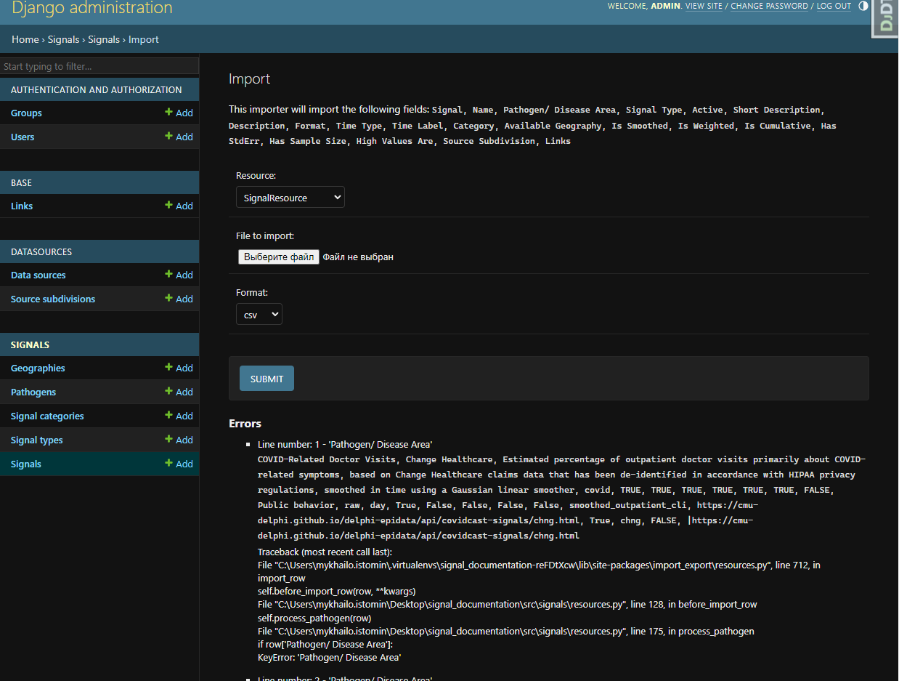

Import data from admin interface
================================

For data import used
`django-import-export <https://django-import-export.readthedocs.io/en/latest/index.html>`__
library

The code consists of Django resource classes that are used for importing
and exporting CSV files using the Django Import-Export library:

Resources
---------

1. ``SignalResource`` - this resource class is used for importing ``Signal`` models:

   - Defines various fields such as ``name``, ``display_name``, ``pathogen``, ``signal_type``, and ``source``.
   - Defines the ``before_import_row`` method, which is called before importing each row and allows for pre-processing of the data.
   - Includes methods like ``is_url_in_domain`` to check if a URL belongs to a specific domain, ``fix_boolean_fields`` to handle boolean fields, and ``process_links`` to process the links field.

2. ``SignalBaseResource`` - This resource class is used for updating
   already created ``Signal`` models ``base`` fields with base Signals:

   -  Defines various fields such as ``name``, ``display_name``,
      ``base``, and ``source``.
   -  Defines the ``before_import_row`` method, which is called before
      importing each row and allows for pre-processing of the data.
   -  The ``process_base`` method is responsible for processing the
      ``base`` field by retrieving the corresponding ``Signal`` object
      based on the provided ``name`` and ``source``.

3. ``SourceSubdivisionResource`` - this resource class is used for
   importing ``SourceSubdivision`` models:

   -  It defines fields such as ``name``, ``display_name``,
      ``description``, ``data_source``, and ``links``.
   -  It includes the ``before_import_row`` method for pre-processing
      each row before importing.
   -  The ``process_links`` method is responsible for processing the
      ``links`` field by creating ``Link`` objects based on the provided
      URLs.
   -  The ``process_datasource`` method processes the ``data_source``
      field by creating or retrieving a ``DataSource`` object based on
      the provided name.

These resource classes provide a structured way to import CSV files.
They define the fields, handle pre-processing of data, and interact with
the corresponding models and related objects.

Import data flow
----------------

CSV preparation
~~~~~~~~~~~~~~~

To import data from a CSV file must meet the requirements:
   - CSV file should be properly formatted and contains all the required fields for
     importing, as specified by the resource classes (``SignalResource``, ``SignalBaseResource``, ``SourceSubdivisionResource``).
   - The header rowof the CSV file should match the field names defined in the resource classes.
   - It should not contain empty rows (empty rows may cause validation errors during the import)
   - Colums should be saparateb by ``","``

Othervice you will receive Errors during import process:

|Import errors|

Data import
~~~~~~~~~~~

1. Import ``SourceSubdivision`` instances with
   ``SourceSubdivisionResource`` -
   http://localhost:8000/admin/datasources/sourcesubdivision/import/
   |Import ``SourceSubdivision`` instances| |Confirm importing
   ``SourceSubdivision`` instances|

2. Import ``Signal`` instances with ``SignalResource`` -
   http://localhost:8000/admin/signals/signal/import/ |Import ``Signal``
   instances| |Confirm importing ``Signal`` instances|

3. Import ``Signal.base`` fields with ``SignalBaseResource`` -
   http://localhost:8000/admin/signals/signal/import/ |Import
   ``Signal.base`` field| |Confirm importing ``Signal.base`` fields|

.. |Import ``SourceSubdivision`` instances| image:: ./_static/import_source_subdivision.png
.. |Confirm importing ``SourceSubdivision`` instances| image:: ./_static/import_confirm_source_subdivision.png
.. |Import ``Signal`` instances| image:: ./_static/import_signals.png
.. |Confirm importing ``Signal`` instances| image:: ./_static/import_confirm_signals.png
.. |Import ``Signal.base`` field| image:: ./_static/import_signals_base.png
.. |Confirm importing ``Signal.base`` fields| image:: ./_static/import_confirm_signals_base.png
