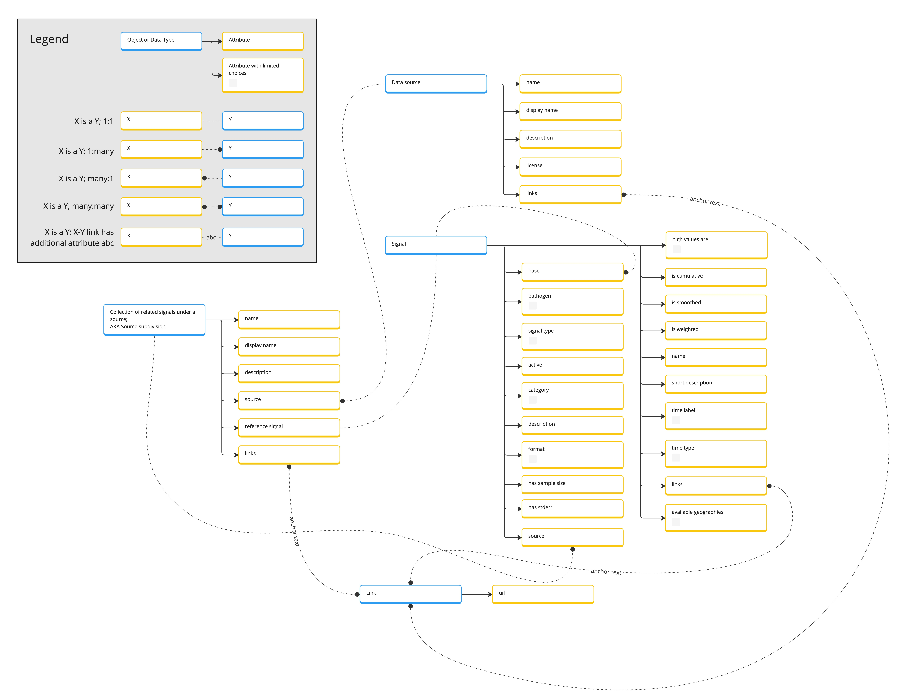
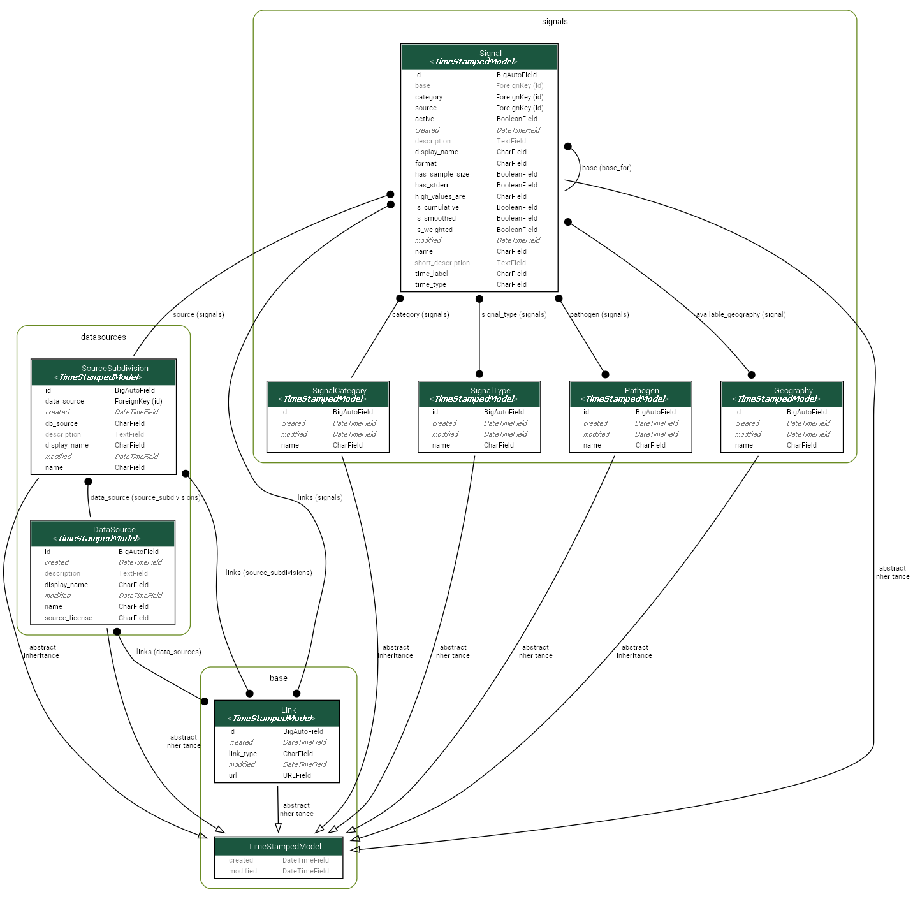

Overview and installation
=========================

Single Source of Documentation System

Entity Relationship Diagram
---------------------------

Core libs and DB
----------------

1. `Django <https://www.djangoproject.com/>`__
2. `Django-filter <https://django-filter.readthedocs.io/en/stable/index.html>`__
3. `PostgreSQL <https://www.postgresql.org/>`__

All requirements you can find in ``Pipfile``

Getting started
---------------

Setup Env Vars
~~~~~~~~~~~~~~

create ``.env`` file and add variables like in ``.env.example``

To run locally
~~~~~~~~~~~~~~

Install ``python:3.10``, ``pip3``, ``pipenv``

Using `pipenv <https://github.com/pypa/pipenv>`__ run ``pipenv shell``
and ``pipenv install`` to create virtual environment and install
dependencies

.. code:: sh

   $ pipenv shell
   $ pipenv install

Go to ``src`` directory and run

.. code:: sh

   $ python manage.py migrate
   $ python manage.py test
   $ python manage.py runserver

load fixtures

.. code:: sh

   $ python manage.py loaddata .\fixtures\available_geography.json
   $ python manage.py loaddata .\fixtures\pathogens.json
   $ python manage.py loaddata .\fixtures\signal_categories.json
   $ python manage.py loaddata .\fixtures\signal_types.json

if you need test coverage

.. code:: sh

   $ coverage erase
   $ coverage python manage.py test
   $ coverage report

you can also get test coverage with one command

.. code:: sh

   $ coverage erase && coverage run manage.py test && coverage report

sort imports

.. code:: sh

   $  isort .

check flake

.. code:: sh

   $  flake8 --show-source

To run via docker
~~~~~~~~~~~~~~~~~

Install ``Docker`` and ``docker-compose``

Run

.. code:: sh

   $ docker-compose build
   $ docker-compose up

Open ``http://localhost:8000`` to view it in the browser

To run via docker and emulate production
~~~~~~~~~~~~~~~~~~~~~~~~~~~~~~~~~~~~~~~~

Though probably not necessary in most cases, if you want to
test/modify/emulate how this will run in production you can:

-  In ``.env`` set:

::

   DEBUG = 'False'

-  Modify the app container's command in ``docker-compose.yaml`` to run:

::

   "gunicorn signal_documentation.wsgi:application --bind 0.0.0.0:8000"

   *(Essentially you'll replace just the last line of the command, switching out the "runserver" line)

Open ``http://localhost`` to view it in the browser. In this usage your
request will be serviced by Nginx instead of the application directly.

The primary use case for this will be when making changes to the Nginx
container image that runs in production and hosts the static file
content, or also if making changes to the Gunicorn config.

Changes of this sort should be carefully evaluated as they may require
interaction with systems managed by devops folks.

`Django admin <https://docs.djangoproject.com/en/4.1/ref/contrib/admin/>`__ web interface
-----------------------------------------------------------------------------------------
Django admin is a web interface for managing the project web application. It is available at the following URL.

``http://localhost:8000/admin``

The user should have ``is_staff`` or ``is_superuser`` permissions to access the admin interface.

Read the docs (Sphynx)
----------------------
Auto generated documentation for the project web appplication is available at the following URL.

``http://localhost:8000/<MAIN_PAGE>/docs/index.html``

To clean the documentation, run the following commands:

.. code:: sh

   $ cd ./docs
   $ make clean

To generate the documentation, run the following commands:

.. code:: sh

   $ cd ./docs
   $ make html
